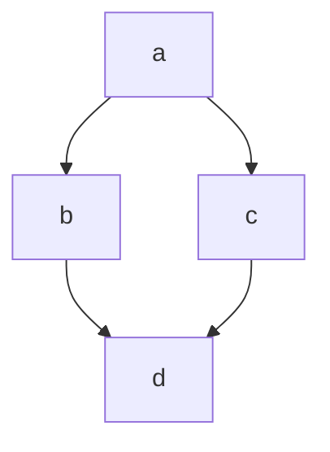
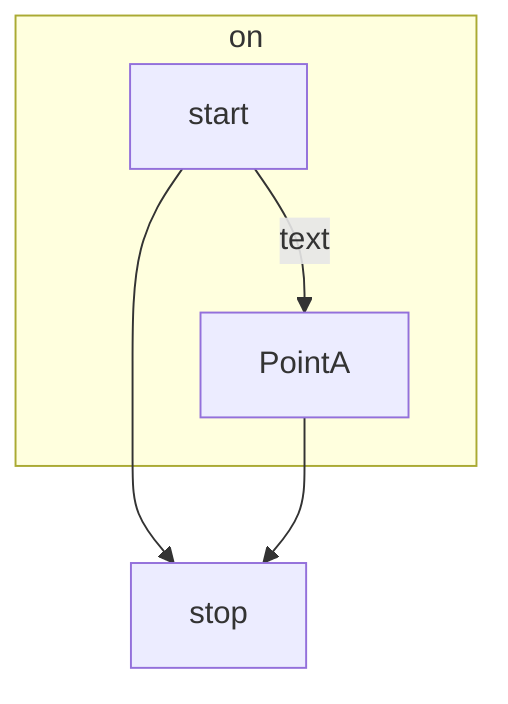
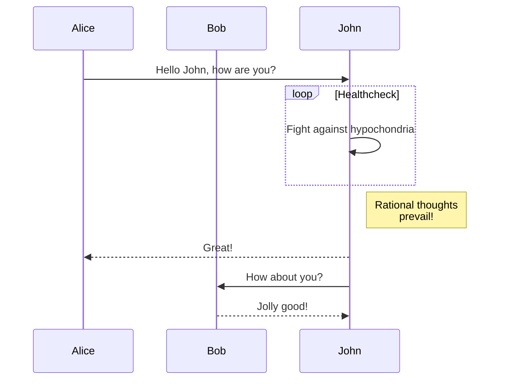
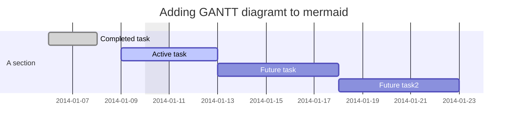
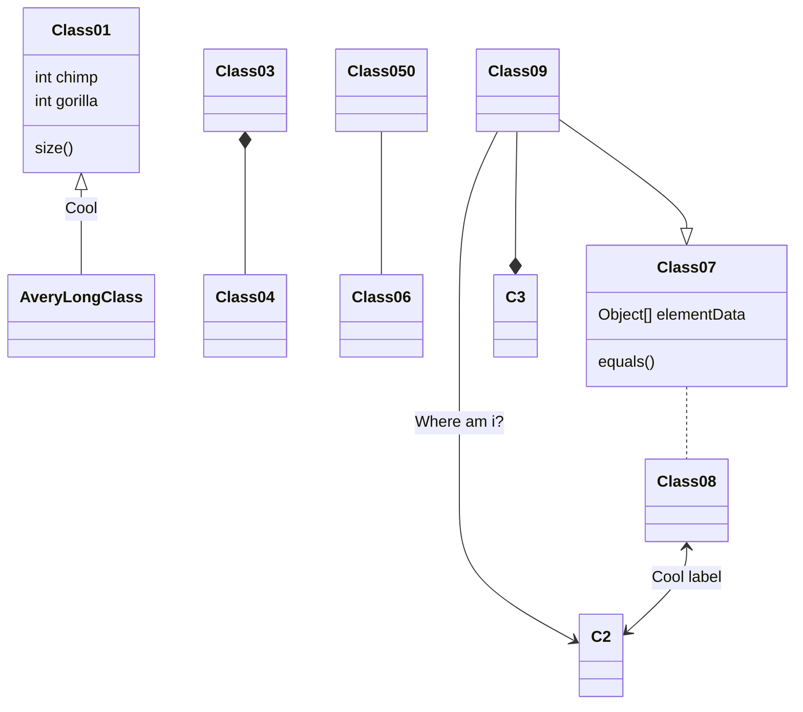

# [Mermaid Tutorial](https://mermaid-js.github.io/mermaid/#/README?id=diagram-types)

## Flowchart

```mermaid
flowchart TD;
    a --> b;
    a --> c;
    b --> d;
    c --> d;
```

```mermaid
flowchart TD
    start --> stop
    subgraph on
    start --> |text|PointA
    end
    PointA --> stop
```

## Sequence diagram

```mermaid
sequenceDiagram;
    participant Alice;
    participant Bob;
    Alice ->> John: Hello John, how are you?;
    loop Healthcheck
        John ->> John: Fight against hypochondria;
    end
    Note right of John: Rational thoughts <br/> prevail!
    John -->> Alice: Great!
    John ->> Bob: How about you?
    Bob -->> John:   Jolly good!
```

## Gantt diagram

```mermaid
gantt
    dateFormat YYYY-MM-DD
    title Adding GANTT diagramt to mermaid
    excludes weekdays 2014-01-10

    section A section
    Completed task :done, des1, 2014-01-06, 2014-01-08
    Active task :active, des2, 2014-01-09, 3d
    Future task : des3, after des2, 5d
    Future task2 : des4, after des3, 5d
```

## Class diagram

```mermaid
classDiagram
    Class01 <|-- AveryLongClass : Cool
    Class03 *-- Class04
    Class05 0-- Class06
    Class07 .. Class08
    Class09 --> C2 : Where am i?
    Class09 --* C3
    Class09 --|> Class07
    Class07 : equals()
    Class07 : Object[] elementData
    Class01 : size()
    Class01 : int chimp
    Class01 : int gorilla
    Class08 <--> C2: Cool label
```
