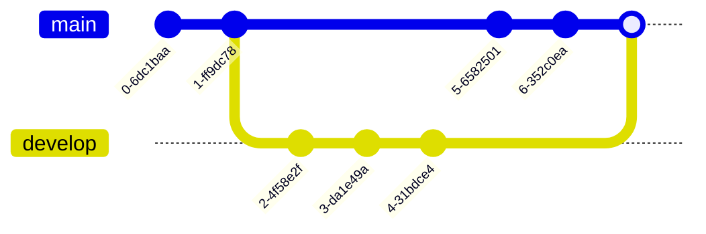
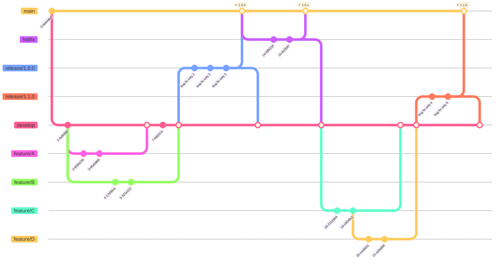

# [Mermaid Tutorial](https://mermaid-js.github.io/mermaid/#/README?id=diagram-types)

## Flowchart

## Sequence diagram

## Gantt diagram

## Class diagram

## Git Graph

### Sample

### Git Flow

1. main
2. hotfix
3. release/1.0.0
4. release/1.1.0
5. develop
6. feature/A
7. feature/B
8. feature/C
9. feature/D

